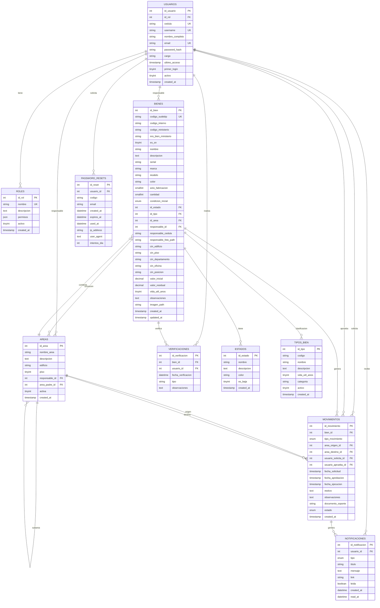

# Diagrama Entidad-Relación (ER)

Este es el diagrama de la estructura de la base de datos del Sistema de Bienes Nacionales MCP.

## Descripción de Tablas Principales

### ROLES
Define los roles de usuario: administrador, gerencia_bn, controlador_inventario, registrador, validador_inventario.

### USUARIOS
Almacena toda la información de los usuarios del sistema. Relacionado con ROLES.

### AREAS
Estructura de áreas del hospital. Puede ser jerárquica (un área puede tener sub-áreas).

### BIENES
Tabla principal que almacena todos los bienes nacionales. Incluye información técnica, ubicación (C.I.N), responsable y datos económicos.

### ESTADOS
Estados posibles de un bien: Operativo, Inoperativo, En Resguardo, Chatarra, Desincorporado.

### TIPOS_BIEN
Clasificación de bienes según Publicación 9: Equipos Oficina, Alojamiento, Material Construcción, Vehículos, etc.

### MOVIMIENTOS
Registra todos los movimientos de bienes: traslados, desincorporaciones, asignaciones. Permite auditoría completa.

### NOTIFICACIONES
Notificaciones en tiempo real para usuarios sobre cambios en bienes o movimientos.

### VERIFICACIONES
Registro de verificaciones físicas realizadas para auditoría semestral.

### PASSWORD_RESETS
Gestión de recuperación de contraseñas con tokens temporales.

---

**Notas:**
- PK = Primary Key (Clave Primaria)
- FK = Foreign Key (Clave Foránea)
- UK = Unique Key (Clave Única)
- Todas las tablas tienen índices en claves foráneas para mejor rendimiento.
