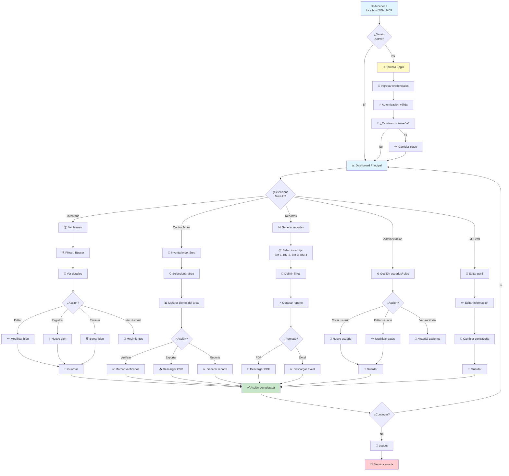
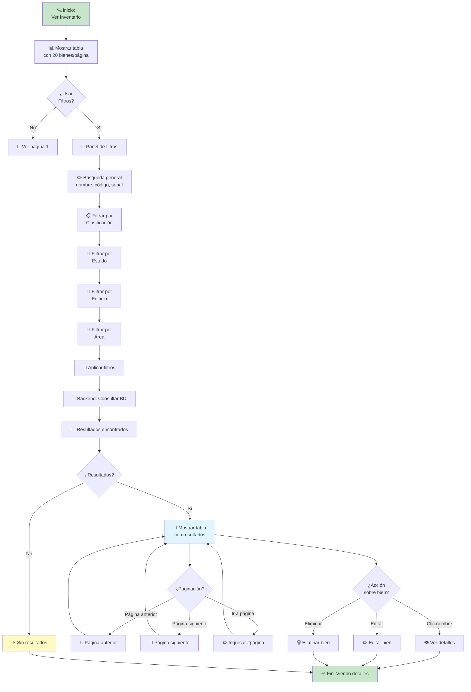
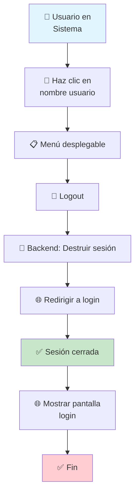

# Diagrama de Flujo de Acciones del Usuario

## 1. Flujo Principal del Sistema

## 2. Flujo Detallado: Registro de Bien

```mermaid
flowchart TD
    A["📦 Inicio:<br/>Registrar Bien"] --> B["📋 Mostrar formulario<br/>6 pasos"]
    
    B --> C["Paso 1:<br/>Clasificación"]
    C --> C1["✏️ Seleccionar tipo<br/>de bien"]
    C1 --> C2["✏️ Ingresar código<br/>ministerio"]
    C2 --> C3{"¿Permiso<br/>asignar Nro?"}
    C3 -->|Sí| C4["✏️ Ingresar<br/>Nro. Bien"]
    C3 -->|No| C5["ℹ️ Será asignado<br/>por Gerencia"]
    C4 --> C6["✏️ Seleccionar<br/>Estado"]
    C5 --> C6
    C6 --> C7["➡️ Siguiente"]
    
    C7 --> D["Paso 2:<br/>Identificación"]
    D --> D1["✏️ Nombre bien"]
    D1 --> D2["✏️ Descripción"]
    D2 --> D3["✏️ Marca, Modelo,<br/>Serial, Color"]
    D3 --> D4["✏️ Año, Condición"]
    D4 --> D5["📸 Foto bien<br/>opcional"]
    D5 --> D6["➡️ Siguiente"]
    
    D6 --> E["Paso 3:<br/>Ubicación C.I.N"]
    E --> E1["✏️ Seleccionar<br/>área"]
    E1 --> E2["✏️ Oficina,<br/>Posición"]
    E2 --> E3["🔄 Sistema genera<br/>C.I.N"]
    E3 --> E4["➡️ Siguiente"]
    
    E4 --> F["Paso 4:<br/>Responsable"]
    F --> F1["✏️ Seleccionar<br/>responsable<br/>opcional"]
    F1 --> F2["✏️ Cédula<br/>opcional"]
    F2 --> F3["📸 Foto responsable<br/>opcional"]
    F3 --> F4["➡️ Siguiente"]
    
    F4 --> G["Paso 5:<br/>Datos Económicos"]
    G --> G1["✏️ Valor unitario<br/>defecto: 0.0"]
    G1 --> G2["✏️ Valor residual"]
    G2 --> G3["✏️ Vida útil<br/>defecto: 10 años"]
    G3 --> G4["✏️ Factura, Fecha"]
    G4 --> G5["➡️ Siguiente"]
    
    G5 --> H["Paso 6:<br/>Observaciones"]
    H --> H1["✏️ Notas<br/>opcionales"]
    H1 --> H2["🔘 Guardar Bien"]
    
    H2 --> I["🔍 Backend: Validar"]
    I --> I1{Validar<br/>CSRF?}
    I1 -->|No| I2["❌ Error seguridad"]
    I1 -->|Sí| I3{Validar<br/>Datos?}
    I3 -->|Inválido| I4["❌ Mostrar errores<br/>ir al paso con error"]
    I3 -->|Válido| I5{Verificar<br/>Duplicados?}
    I5 -->|Duplicado| I6["❌ Mostrar<br/>duplicado"]
    I5 -->|No| J["✅ Generar códigos"]
    
    J --> J1["💾 Insertar bien"]
    J1 --> J2["📸 Subir imágenes"]
    J2 --> J3["📝 Registrar auditoría"]
    J3 --> J4["🔗 Crear movimiento<br/>incorporación"]
    J4 --> J5["✅ Éxito"]
    
    J5 --> K["🎉 Modal de éxito"]
    K --> L["🔄 Redirigir a inventario"]
    
    I2 --> M["🚫 Fin: Error"]
    I4 --> M
    I6 --> M
    L --> N["✅ Fin: Bien registrado"]
    
    style A fill:#c8e6c9
    style N fill:#c8e6c9
    style M fill:#ffcdd2
    style J5 fill:#e1f5ff
```

## 3. Flujo de Búsqueda y Filtrado en Inventario

## 4. Flujo de Logout y Cierre de Sesión

---

**Leyenda de Símbolos:**
- 🟢 Inicio/Final verde
- 📦 Proceso
- ✏️ Entrada de usuario
- ✅ Confirmación/Éxito
- ❌ Error/Rechazo
- 💾 Almacenamiento
- 🔄 Proceso backend
- 📊 Datos/Tabla
- 🔍 Búsqueda/Filtro
- ➡️ Siguiente paso
- ⚠️ Advertencia
- 🎉 Evento especial
