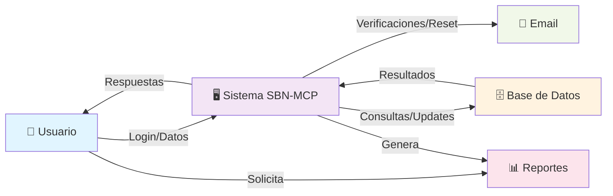
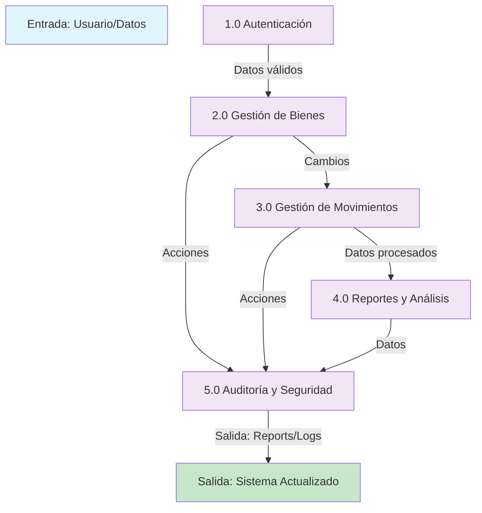
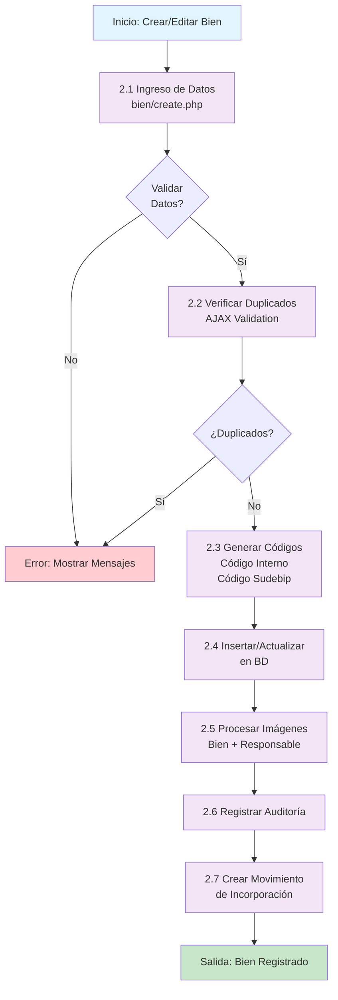
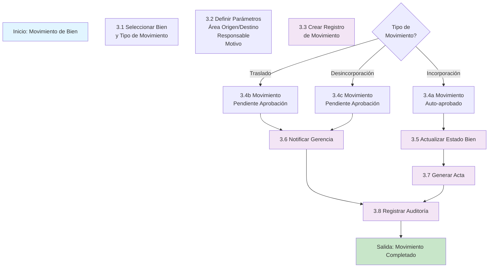
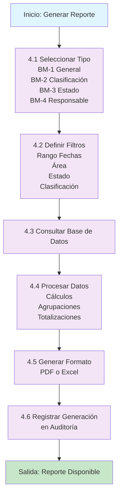
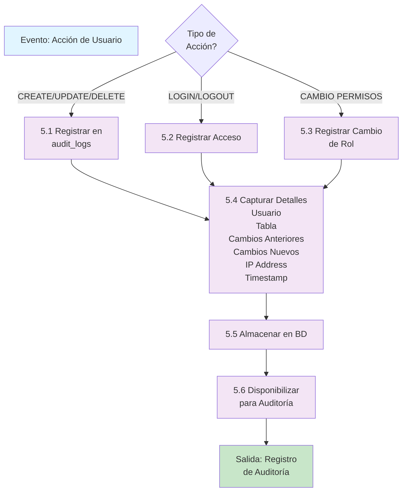

# Diagrama de Flujo de Datos (DFD)

## Nivel 0: Visión General del Sistema



## Nivel 1: Procesos Principales



## Nivel 2: Proceso 2.0 - Gestión de Bienes



## Nivel 2: Proceso 3.0 - Gestión de Movimientos



## Nivel 2: Proceso 4.0 - Reportes y Análisis



## Nivel 2: Proceso 5.0 - Auditoría y Seguridad



## Almacenes de Datos (Detalles de Archivos/Tablas)

```
D1: Usuarios
    - id_usuario
    - cedula, username, email, password_hash
    - id_rol, cargo
    - created_at, updated_at

D2: Bienes
    - id_bien
    - codigo_sudebip, codigo_interno, nro_bien_ministerio
    - nombre, descripcion, serial, marca, modelo
    - id_tipo, id_area, id_estado, responsable_id
    - responsable_cedula, responsable_foto_path
    - imagen_path
    - valor_inicial, valor_residual, vida_util_anos
    - created_at, updated_at

D3: Movimientos
    - id_movimiento
    - bien_id, tipo_movimiento
    - area_origen_id, area_destino_id
    - usuario_solicita_id, usuario_aprueba_id
    - estado, fecha_solicitud, fecha_aprobacion
    - motivo, observaciones

D4: Auditoría
    - id_auditoria
    - usuario_id, accion (INSERT/UPDATE/DELETE)
    - tabla, registro_id
    - cambios_anterior (JSON)
    - cambios_nuevo (JSON)
    - fecha, ip_address

D5: Notificaciones
    - id_notificacion
    - usuario_id, tipo, titulo, mensaje
    - leida, created_at, read_at

D6: Áreas
    - id_area
    - nombre_area, edificio, piso
    - responsable_id, area_padre_id
    - activa
```

---

**Leyenda:**
- Las elipses azules (👤) representan actores externos (usuarios)
- Los rectángulos morados representan procesos
- Los cilindros naranjas (🗄️) representan almacenes de datos
- Las flechas representan flujo de información
