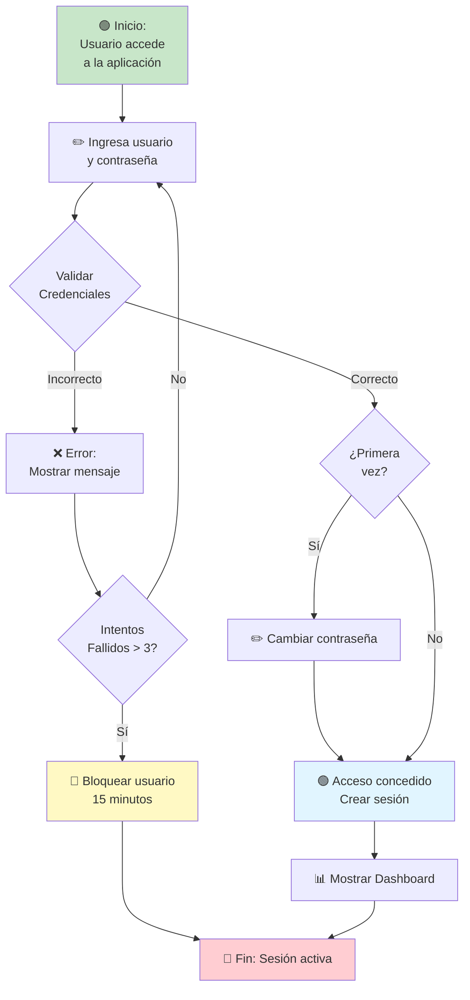
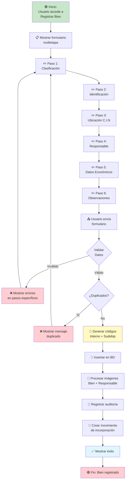
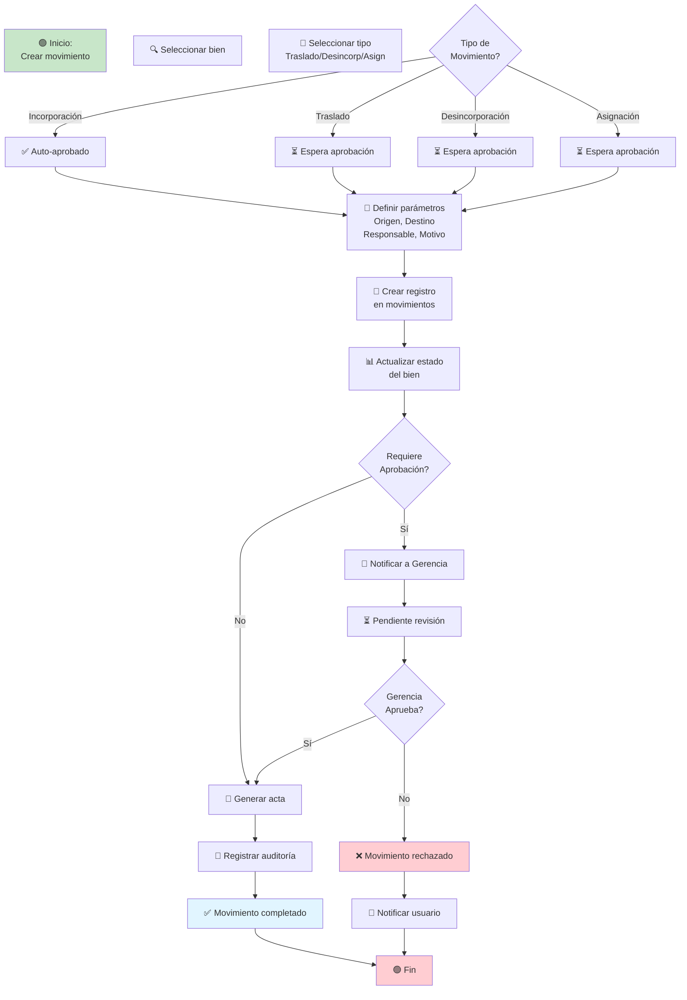
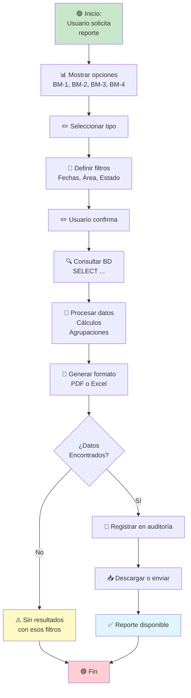
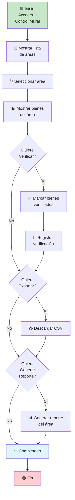

# Diagrama de Procesos - BPMN

## Proceso 1: Flujo de Autenticación

## Proceso 2: Flujo de Registro de Bien

## Proceso 3: Flujo de Movimiento de Bien

## Proceso 4: Flujo de Generación de Reportes

## Proceso 5: Flujo de Control Mural (Inventario por Área)

---

**Leyenda:**
- 🟢 Inicio/Fin
- 📋 Proceso
- ✏️ Entrada de usuario
- ✅ Confirmación
- ❌ Error/Rechazo
- 💾 Almacenamiento
- 📊 Reporte
- 🔔 Notificación
- ⏳ Espera
- 📝 Registro
